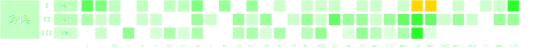

# Moje rozwiązania do zadań z Olimpiady Informatycznej

## Struktura repozytorium:

Zawartości katalogów `skrypty`, oraz `materialy` łatwo się domyślić, zachęcam do zapoznania się z nią.
W katalogu `rozwiazania` znajdziesz wszystkie rozwiązania zadań z OI, które zaimplementowałem.
Katalog `rozwiazania/<edycja_oi>/<etap_oi>/[dzień_etapu]/<skrót zadania>` zawiera pliki dotyczące danego zadania z OI.
- `<skrót zadania>.cpp` - moje rozwiązanie zadania, które otrzymuje 100 pkt na testach na sio2/szkopule, 
        dodatkowo z dopiskiem `_alt` bądź `_oi` pojawiają się czasem rozwiązania alternatywne oraz wprost z omówienia zadania,
        w przypadkach gdy rozwiązałem zadanie na 100 punktów na kilka różnych sposobów.
- `<skrót zadania><liczba punktów>.cpp` - Rozwiązania, które dostają mniej niż 100 punktów, takie jak bruty, bądź rozwiązania podgrup.
I dosyć często również pliki: 
- `<skrót zadania>g.cpp` - moja generatorka do zadania, której używałem testując rozwiązanie.
- `<skrót zadania>chk.cpp` - moja czekerka w przypadku zadań, w których istnieje więcej niż jedno poprawne rozwiązanie inne niż generowane przez bruta.
- Katalog `virtual_contest/`, zawierający moje skrypty, generatorki, czekerki i różne podejścia do zadania w przypadku, gdy symulowałem ograniczenia czasu i widoczności werdyktów występujące na olimpiadzie, tzn. w przypadku etapów I i II olimpiady, nie mogłem poznać liczby punktów, które dostanie moje zadanie na sprawdzarce szkopuł. Testowałem rozwiązanie lokalnie, i wysyłałem dopiero po przetestowaniu. Rozwiązania zadań z III etapu mogłem wysłać do 10 rozwiązań na szkopuła poznając ich wynik.

Katalogi `checklista` oraz `.github` zawierają skrypty automatycznie generujące checklisty, nie należy ich modyfikować. 
Jeśli coś nie działa, daj mi znać przez [Issue](https://github.com/Kulezi/oi/issues) na GitHubie.

Przykładowo katalog `rozwiazania/xxv/etap3/dzien1/kom/` będzie zawierał moje rozwiązania do zadania 'Liczby kompletne' z III etapu XXV OI.
Rozwiązania konkretnego zadanie można łatwo znaleźć sprawdzając, z której edycji i etapu olimpiady jest na [Liście zadań OI](https://oi.edu.pl/l/oi_zadania/),
bądź przy pomocy polecenia `grep 'nazwa zadania' -R .` wywołanego z głównego katalogu repozytorium, np. `grep `Trójkąty` -R .`.

## Jak samemu skorzystać z checklisty:

Sforkuj [szablon](https://github.com/testowyuczen/oi) tego repozytorium [klikając tutaj](https://github.com/testowyuczen/oi/fork), i w zakładce Actions swojego repozytorium kliknij `I understand my workflows, go ahead and enable them` - bez tego checklista nie będzie się aktualizować automatycznie.

Po wbiciu jakiegoś zadania, np 'Rycerz:wq' z pierwszego dnia II etapu XXXI OI:
- Zapisz rozwiązanie. np. w pliku `rozwiazania/xxxi/etap2/dzien1/ryc/ryc.cpp`.
- Dodaj je do repozytorium wykonując `git add `rozwiazania/xxxi/etap2/dzien1/ryc/ryc.cpp`, (przy pomocy `git status` możesz zobaczyć co już dodałeś w tym commicie).
- Scommituj je np. w ten sposób: `git commit -m "Dodano rozwiązanie zadania 'Rycerz' z XXXI OI"` (jeśli zapomnieliśmy czegoś dodać wystarczy powtórzyć poprzedni krok i użyć `git commit --am`.
- Zaktualizuj repozytorium na GitHub o lokalne zmiany przy pomocy `git push`, ewentualnie `git push -f`.
- Checklista w `README.md` na GitHub zaktualizuje się automatycznie w ciągu kilku minut.
- `git pull` wciągnie aktualną wersję checklisty z GitHuba (bez tego będziesz potrzebował robić `git push -f` przy każdym pushu.

<!-- AUTO-CHECKLIST -->

> ⚠️ **UWAGA:** Sekcja poniżej jest generowana automatycznie.
> Nie modyfikuj README poniżej tego napisu.
> ✅ oznacza wykonane zadanie.
> 🤔 oznacza zadanie z mniej niż 100 punktów.

# Podsumowanie

## Rozwiązane zadania wg etapów

Etap I | Etap II | Etap III | Łącznie
:---: | :---: | :---: | :---:
41/150 (27%) | 80/157 (51%) | 32/200 (16%) | 153/507 (30%)

## Rozwiązane zadania wg edycji

Edycja | Wynik | Edycja | Wynik | Edycja | Wynik | Edycja | Wynik
:--- | ---: | :--- | ---: | :--- | ---: | :--- | ---:
I | 4/10 (40%) | XI | 1/16 (6%) | XXI | 6/17 (35%) | XXXI | 9/17 (53%)
II | 5/14 (36%) | XII | 3/17 (18%) | XXII | 6/17 (35%) | XXXII | 8/18 (44%)
III | 0/13 (0%) | XIII | 5/16 (31%) | XXIII | 7/17 (41%) |  | 
IV | 3/16 (19%) | XIV | 2/16 (12%) | XXIV | 9/16 (56%) |  | 
V | 1/16 (6%) | XV | 6/16 (38%) | XXV | 7/18 (39%) |  | 
VI | 2/15 (13%) | XVI | 5/16 (31%) | XXVI | 5/17 (29%) |  | 
VII | 4/15 (27%) | XVII | 8/17 (47%) | XXVII | 3/10 (30%) |  | 
VIII | 4/15 (27%) | XVIII | 7/17 (41%) | XXVIII | 4/17 (24%) |  | 
IX | 6/15 (40%) | XIX | 6/17 (35%) | XXIX | 5/17 (29%) |  | 
X | 2/16 (12%) | XX | 4/17 (24%) | XXX | 6/17 (35%) |  |

## Rozwiązane zadania z I etapu

Edycja | zad. 1 | zad. 2 | zad. 3 | zad. 4 | zad. 5 | zad. 6
:--- | ---: | ---: | ---: | ---: | ---: | ---:
I | spo ✅ | pio 🤔 | tro ✅ | — | — | —
II | jed ✅ | jez ✅ | pal ✅ | drz ✅ | — | —
III | gon 🤔 |   |   |   | — | —
IV |   |   |   |   | — | —
V |   |   |   |   | — | —
VI |   |   |   |   | — | —
VII | bro ✅ | pas ✅ |   |   | — | —
VIII | map ✅ | prz ✅ | ant ✅ |   | — | —
IX | kom ✅ | wys ✅ | kol ✅ |   | — | —
X | cze ✅ | prz ✅ |   |   |   | —
XI |   |   |   |   |   | —
XII |   |   |   |   |   | —
XIII | kra ✅ | okr ✅ |   |   |   | —
XIV |   |   |   |   |   | —
XV | pla ✅ |   |   |   |   | —
XVI | kam ✅ |   |   |   |   | —
XVII | gil ✅ | kor ✅ | tes ✅ |   |   | —
XVIII | liz ✅ |   |   |   |   | —
XIX | lit ✅ |   |   |   |   | —
XX |   |   |   |   |   | —
XXI | kur ✅ |   |   |   |   | —
XXII |   |   |   |   |   | —
XXIII |   |   |   |   |   | —
XXIV | rep 🤔 | sab ✅ | pod ✅ |   |   | —
XXV | pow 🤔 | pra 🤔 |   |   |   | —
XXVI | klu 🤔 | nie 🤔 |   |   |   | —
XXVII | pom 🤔 |   |   |   |   | —
XXVIII | cuk ✅ |   |   |   |   | —
XXIX |   |   |   |   |   | —
XXX | ply ✅ |   |   |   |   | —
XXXI | zap ✅ | prz ✅ | bud ✅ | cza ✅ | sat ✅ | —
XXXII | bit ✅ | wal ✅ | spr ✅ | zam ✅ | usu ✅ | kas ✅

## Rozwiązane zadania z II etapu

Edycja | zad. próbne | Dzień 1 - zad. 1 | Dzień 1 - zad. 2 | Dzień 2 - zad. 1 | Dzień 2 - zad. 2
:--- | ---: | ---: | ---: | ---: | ---:
I | sum ✅ |   | — |   | —
II |   | tro ✅ |   |   |  
III |   |   | — | haz 🤔 |  
IV |   |   |   |   |  
V |   | row ✅ |   | ple 🤔 |  
VI |   | lun ✅ |   | bit ✅ |  
VII | pod 🤔 | tro ✅ |   |   |  
VIII |   |   |   |   |  
IX | izo ✅ | dzi ✅ |   |   |  
X |   |   |   |   |  
XI |   |   |   |   |  
XII |   | ban ✅ |   | kos 🤔 | sza ✅
XIII |   | met ✅ | naj ✅ |   |  
XIV |   |   |   | tet ✅ |  
XV | blo 🤔 | bbb ✅ | poc ✅ | maf ✅ | uci ✅
XVI |   | kon ✅ | baj ✅ | lyz ✅ | arc ✅
XVII |   | cho ✅ | klo ✅ | tel ✅ | owc 🤔
XVIII |   | smi ✅ | roz ✅ | rod ✅ | tem ✅
XIX |   | bon ✅ | sza ✅ | roz ✅ | okr ✅
XX | spa 🤔 | luk 🤔 |   | mor ✅ | kon ✅
XXI |   | prz ✅ |   | raj ✅ | pta ✅
XXII |   | pod ✅ | pus ✅ | trz ✅ | kur ✅
XXIII | swi ✅ | dro ✅ | zaj ✅ | wca ✅ | ark ✅
XXIV | zaw ✅ | sum ✅ | str ✅ | kon ✅ | zam ✅
XXV | prz ✅ | dro ✅ | kon ✅ | tom ✅ | tel ✅
XXVI | roz 🤔 | gwi ✅ | kol ✅ | cyk ✅ | osi ✅
XXVII | wak 🤔 | wie ✅ | czw ✅ | mar ✅ | tru 🤔
XXVIII | pro ✅ | ple ✅ |   | pla ✅ |  
XXIX | arm 🤔 | lic ✅ | age ✅ | kon 🤔 |  
XXX | wir ✅ | wag ✅ | gra ✅ | wsp ✅ | drw ✅
XXXI | tel ✅ | lic ✅ | ryc 🤔 | cia ✅ | poj ✅
XXXII | sss ✅ | drz ✅ |   |   |

## Rozwiązane zadania z III etapu

Edycja | Dzień próbny, zad. 1 | Dzień próbny, zad. 2 | Dzień 1 - zad. 1 | Dzień 1 - zad. 2 | Dzień 1 - zad. 3 | Dzień 2 - zad. 1 | Dzień 2 - zad. 2 | Dzień 2 - zad. 3
:--- | ---: | ---: | ---: | ---: | ---: | ---: | ---: | ---:
I |   | — | ana ✅ |   | — |   | — | —
II |   | — |   |   | — |   |   | —
III |   | — |   |   | — |   |   | —
IV |   | — | kaj ✅ | tro ✅ |   | rez ✅ |   | —
V |   | — |   |   |   |   |   |  
VI |   | — |   |   | — |   |   |  
VII |   | — |   |   | — | age ✅ |   |  
VIII |   | — |   |   | — | kop ✅ |   |  
IX | min ✅ | — |   |   | — |   |   |  
X |   | — |   |   | — |   |   |  
XI |   | — |   |   |   | mis ✅ |   | —
XII |   | — |   |   |   | aut ✅ |   |  
XIII |   | — |   |   | — | pal ✅ |   |  
XIV |   | — | gaz ✅ |   | — |   |   |  
XV |   | — | pod 🤔 |   |   | sta ✅ |   | —
XVI |   | — |   |   |   |   |   | —
XVII |   | — | gra ✅ |   |   | pil ✅ |   |  
XVIII |   | — |   |   |   | pat ✅ |   |  
XIX |   | — | lic ✅ |   |   |   |   |  
XX |   | — | lan ✅ |   |   | las ✅ |   |  
XXI | far ✅ | — | tur 🤔 |   |   | zal ✅ |   |  
XXII |   | — | wil ✅ |   |   | kol ✅ |   |  
XXIII |   | — | zyw ✅ | pra ✅ | pos 🤔 |   |   |  
XXIV |   | — | mid ✅ | oce ✅ |   | kuc 🤔 |   | —
XXV | trz ✅ |   | kom 🤔 |   |   | tak ✅ |   |  
XXVI |   | — | zja 🤔 | rem 🤔 |   | dlu ✅ |   |  
XXVII | — | — | — | — | — | — | — | —
XXVIII | kol 🤔 | — |   |   |   |   |   |  
XXIX | zer ✅ |   | wyb ✅ | rze 🤔 | glo ✅ | met 🤔 |   |  
XXX |   | — |   |   |   |   |   |  
XXXI | sta 🤔 | — | buk 🤔 | wys 🤔 | ska 🤔 | wyj 🤔 |   |
